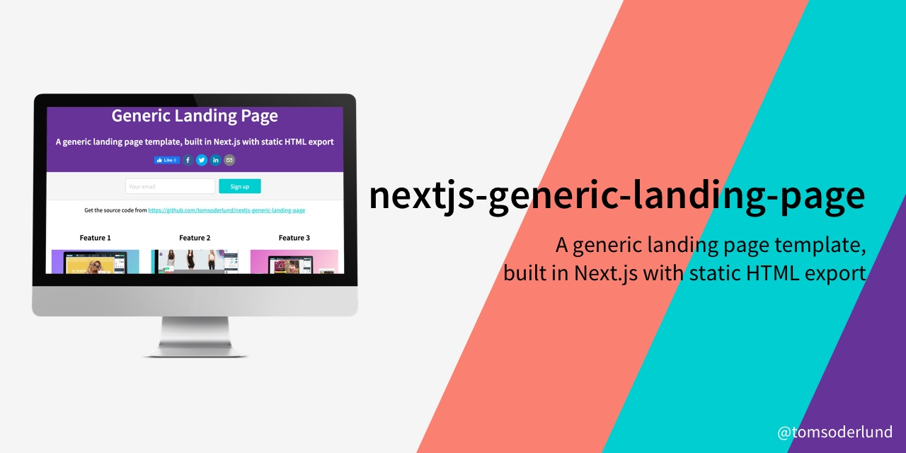
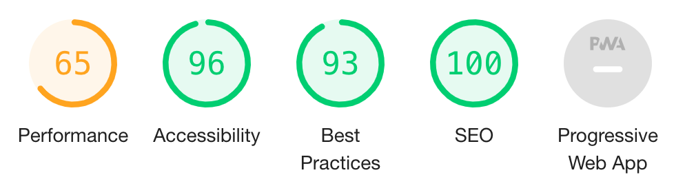

# Next.js generic landing page template

A generic landing page template, built in Next.js (React) with static HTML export.

Can be used as:

1. Hosted Next.js site
2. Use `yarn export` to export pure HTML pages

_Note: if you need a template for a complete PWA web app (with database etc) in Next.js, check out [nextjs-pwa-firebase-boilerplate](https://github.com/tomsoderlund/nextjs-pwa-firebase-boilerplate)._

## Support this project

Did you or your company find `nextjs-generic-landing-page` useful? Please consider giving a small donation, it helps me spend more time on open-source projects:

## Why is this awesome?

This is a great template for a any project where you want **React** (with **static site generation (SSG)** or **server-side rendering (SSR)**, powered by [Next.js](https://github.com/zeit/next.js)) as frontend. *Lightning fast, all JavaScript.*

* Great starting point for a landing page or simple website.
* Use `yarn export` to export pure HTML pages.
* Prepared for PWA features with a `manifest.json`.
* Can use SSG `getStaticProps` or SSR `getServerSideProps`.
* Easy to style the visual theme using CSS (e.g. using [Design Profile Generator](https://tomsoderlund.github.io/design-profile-generator/)).
* Google Analytics and `google-site-verification` support (see `config/config.js`).
* Flexible configuration with `config/config.js` and `.env.local` file.
* Code linting and formatting with StandardJS (`yarn lint`/`yarn fix`).
* Unit testing with Jasmine (`yarn unit`, not yet included).
* Good page speed, see [Lighthouse](https://developers.google.com/web/tools/lighthouse) score:

## Demo

[Demo of nextjs-generic-landing-page hosted on Vercel](https://nextjs-generic-landing-page.vercel.app/)

## Components

- [x] Title/Tagline
- [x] Footer
- [x] Signup form
- [x] Image
- [x] Video
- [x] 3 features
- [x] Google Analytics with page & event logging
- [x] Pricing/product comparison table
- [ ] Testimonials (3 people)
- [ ] Login link
- [ ] [React Social Share & Follow](https://github.com/tomsoderlund/react-share-follow)
- [ ] Try the app (interactive)

## How to use

### How to use 1: Clone the entire project

Clone this repository:

    git clone https://github.com/tomsoderlund/nextjs-generic-landing-page.git [MY_APP]

Remove the `.git` folder (since you want to create a new repository) and other template stuff:

    rm -rf .git docs/ public/features/*.jpg

Install dependencies:

    cd [MY_APP]
    yarn  # or npm install

Run:

    yarn dev

Export static HTML:

    yarn export

Test the static HTML:

    cd out
    python -m SimpleHTTPServer

### How to use 2: Import just the components you need

    yarn add nextjs-generic-landing-page  # or npm install nextjs-generic-landing-page

Then in your code:

    import { Headline, Video } from 'nextjs-generic-landing-page'

    <Headline
      title='My Website'
      description='Maybe the best website ever'
    />

See [pages/index.js](pages/index.js) for examples on how to use the components.

### Styling

Modify `public/theme.css` (`public/app.css` is more structural).

You can add fonts in `components/page/PageHead.js`.

## Update the NPM package

    yarn publish  # will run 'yarn prepublish' before
